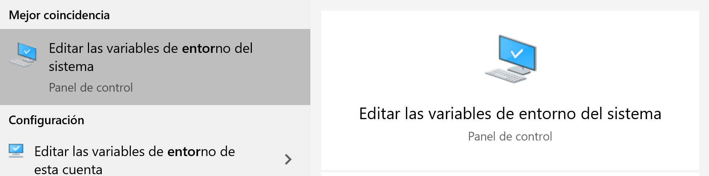
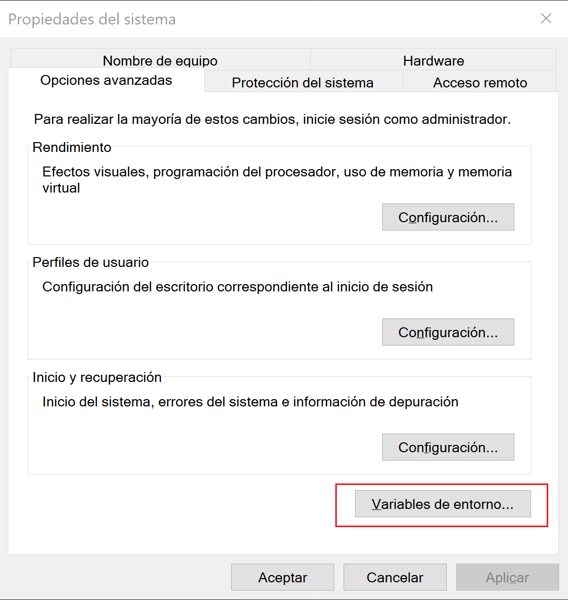
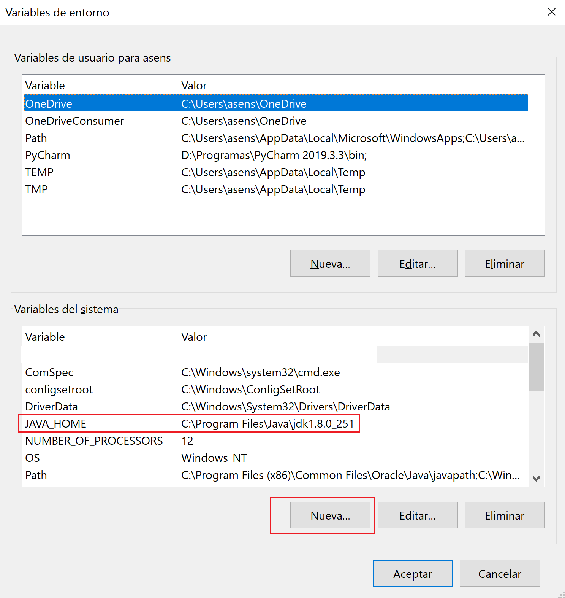

# Developing a Scala app with Cassandra API using Azure Cosmos DB
Azure Cosmos DB is a globally distributed multi-model database. One of the supported APIs is the Cassandra API. This sample walks you through creation of keyspace, table, inserting and querying the data.

## Important: configure JAVA_HOME environ variable 
It is important to have created an environment variable called JAVA_HOME pointing to the java installation directory.

1. Access to system properties:


2. Enter in system environ variables:


3. In system's variables click in New:


**NOTE:** Reboot the system for the changes to take effect

## Configure connection string
In src/main/resources/default.properties you have to configure connection data to your Cassandra DB.
```
cassandra_host=<FILLME>
cassandra_username=<FILLME>
cassandra_password=<FILLME>
ssl_keystore_file_path=<FILLME>
ssl_keystore_password=<FILLME>
```

If ssl_keystore_file_path is not given in default.properties, then by default <JAVA_HOME>/jre/lib/security/cacerts will be used If ssl_keystore_password is not given in config.properties, then the default password 'changeit' will be used

## Review the code
If you're interested in learning how the database resources are created in the code, you can review the following snippets.

* Cassandra Host, Port, User name and password is set using the connection string page in the Azure portal.
```Scala
cluster = Cluster.builder.addContactPoint(cassandraHost).withPort(cassandraPort.toInt).withCredentials(cassandraUsername, cassandraPassword).withSSL(sslOptions).build
```

* The cluster connects to the Azure Cosmos DB Cassandra API and returns a session to access.
```Scala
def getSession: Session = {
    ...
    cluster.connect
}
```

* A new keyspace is created.
```Scala
def createKeyspace(): Unit = {
    val query = "CREATE KEYSPACE IF NOT EXISTS uprofile WITH REPLICATION = { 'class' : 'NetworkTopologyStrategy', 'datacenter1' : 1 }"
    session.execute(query)

    println("Created keyspace 'uprofile'")
  }
```

* A new table is created.
```Scala
def createTable(): Unit = {
    val query = "CREATE TABLE IF NOT EXISTS uprofile.user (user_id int PRIMARY KEY, user_name text, user_bcity text)"
    session.execute(query)

    println("Created table 'user'")
  }
```

* User entities are inserted using a prepared statement object.
```Scala
def prepareInsertStatement(): PreparedStatement = {
    val insertStatement = "INSERT INTO  uprofile.user (user_id, user_name , user_bcity) VALUES (?,?,?)"
    session.prepare(insertStatement)
  }

def insertUser(statement: PreparedStatement, id: Int, name: String, city: String): Unit = {
    val boundStatement = new BoundStatement(statement)
    session.execute(boundStatement.bind(id, name, city))
  }
```

* Query to get get all User information.
```Scala
def selectAllUsers(): Unit = {
    val query = "SELECT * FROM uprofile.user"
    val rows = session.execute(query).all

    rows.forEach(row => println(row.getString("user_name")))
  }
```

* Query to get a single User information.
```Scala
def selectUser(id: Int): Unit = {
    val query = "SELECT * FROM uprofile.user where user_id = 3"
    val row = session.execute(query).one

    println("Obtained row: {} | {} | {} ", row.getInt("user_id"), row.getString("user_name"), row.getString("user_bcity"))
  }
```